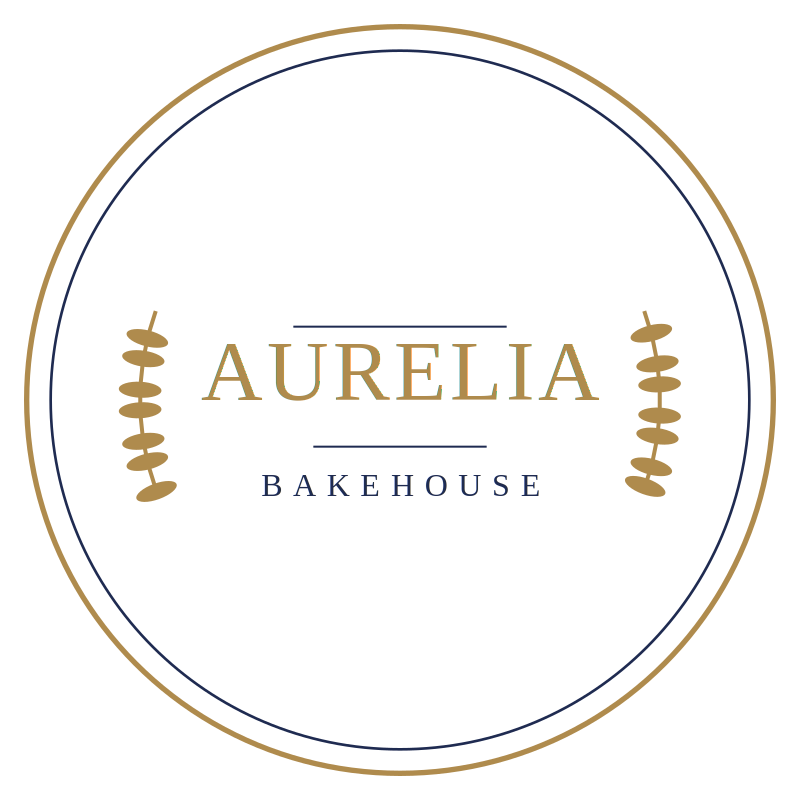
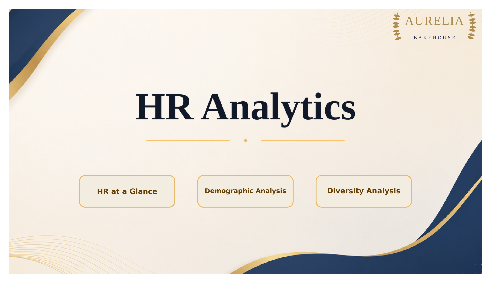
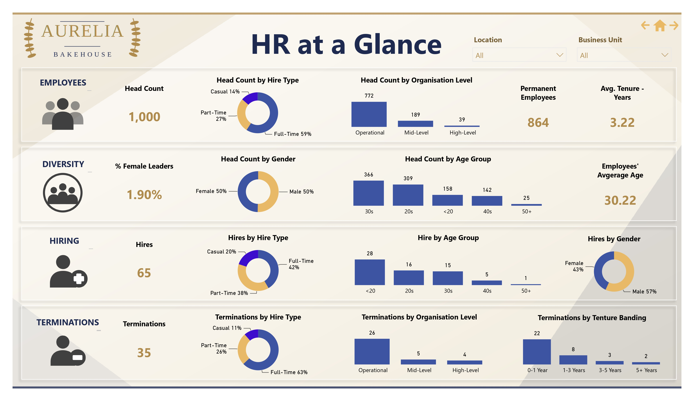
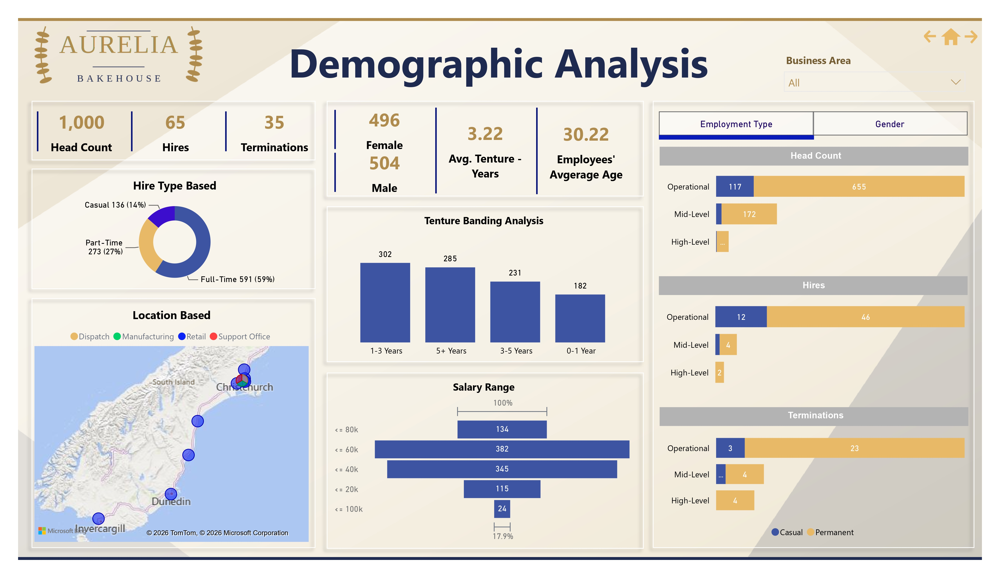
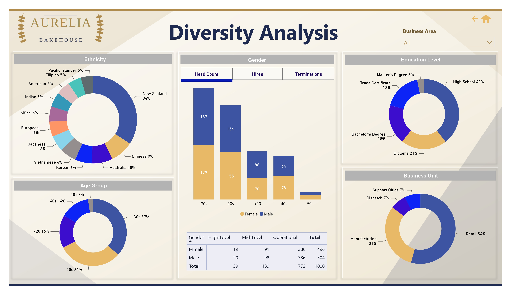

<div align="justify">

<a id="readme-top"></a>

<div align="center">



<br>

# 🥐 HR Analytics Dashboard

### Aurelia Bakehouse — Workforce Insights in Power BI

A Power BI project analysing workforce composition, demographics and diversity for a fictional New Zealand bakery business.

<!-- 🔗 **[View Live Demo](your-link-here)** -->

<p>
  
  
  
  
  
  
  

</p>

</div>

<br>

## 📑 Contents

- [Overview](#-overview)
- [Dashboard Preview](#️-dashboard-preview)
- [Skills Demonstrated](#-skills-demonstrated)
- [Report Pages](#-report-pages)
- [Dashboard Usage](#️-dashboard-usage)
- [About the Data](#-about-the-data)
- [Data Model](#-data-model)
- [Future Improvements](#-future-improvements)
- [Author](#-author)
<!-- - [Repository Structure](#-repository-structure) -->


## 🔎 Overview

**Aurelia Bakehouse** is a fictional New Zealand bakery business operating across retail stores, manufacturing sites, a dispatch team and a support office. As the organisation grows, having visibility into workforce composition, employee demographics and organisational structure becomes increasingly important for effective workforce planning and decision-making.

To support these needs, the **Aurelia Bakehouse HR Analytics Dashboard** was developed to provide HR and People & Culture teams with a clear view of key workforce insights, including headcount, employment status, employee tenure, workforce distribution and diversity indicators.

Designed as a real-world HR reporting solution, the dashboard combines executive-style KPI cards, consistent navigation and a custom brand theme, supported by a structured data model with calculated measures and relationships rather than a single flat table.


## 🖼️ Dashboard Preview

<table>
<tr>
<td width="50%"><p align="center"><sub><b>Cover</b></sub></p></td>
<td width="50%"><p align="center"><sub><b>HR at a Glance</b></sub></p></td>
</tr>
<tr>
<td width="50%"><p align="center"><sub><b>Demographic Analysis</b></sub></p></td>
<td width="50%"><p align="center"><sub><b>Diversity Analysis</b></sub></p></td>
</tr>
</table>


## 🎯 Skills Demonstrated

- **Power Query:** importing and shaping data from three separate Excel workbooks into a usable model
- **Data modelling:** building a star schema
- **DAX:** deriving fields not present in the raw data, through calculated columns and measures
- **Data visualisation:** choosing appropriate chart types
- **Report design and UX:** custom theming, consistent navigation, and bookmark-driven toggle tabs
- **Storytelling with data:** structuring related visuals together across dedicated pages, so each one tells a focused part of the workforce story rather than mixing everything into one view


## ⭐ Report Pages

### 🏠 Cover
- The landing page. 
- Shows the Aurelia Bakehouse logo, dashboard title, and three navigation buttons that jump straight into the report: **HR at a Glance**, **Demographic Analysis**, and **Diversity Analysis**.

### 📋 HR at a Glance
- A high-level summary of the whole workforce, organised into four bands — **Employees**, **Diversity**, **Hiring**, and **Terminations**. Structured so the workforce story reads top to bottom.
- Two independent slicers (Location, Business Unit) for flexible scoping.

### 🗺️ Demographic Analysis
- Interactive map plotting every business area by address
- Salary-range funnel to see pay spread across the organisation
- Tenure-banding chart to spot retention patterns
- Toggle tabs to flip the organsation level breakdown between Employment Type and Gender
- Business Area slicer, scoping the page down to a single area at a time

### 🌍 Diversity Analysis
- Ethinicity, Education Level, Age Group, and Business Unit breakdowns
- Gender split by age-band, which can be toggled between Head Count, Hires, and Terminations
- Business Area slicer, scoping the page down to a single area at a time


## 🖱️ Dashboard Usage

**Navigation:** every analysis page has back, home, and forward icons in the top-right corner. Back and forward step through the report in order, and home returns to the Cover page.

Each analysis page follows the same interaction pattern: **filter with the slicers at the top, then click into any chart to cross-filter the rest of the page.**

## 🧾 About the Data

**All data in this dashboard is fictional.** There's no real company, no real employees, and no sensitive or personally identifiable information involved anywhere in this project. Any similarity to a real name, address, or organisation is coincidental.

The employee, employment and business unit records were AI-generated to look like a plausible HR dataset. The generated data was saved as three separate Excel workbooks (`EmployeeDetails.xlsx`, `EmploymentDetails.xlsx` and `BusinessUnits.xlsx`) before being loaded into Power BI.


## 🧩 Data Model

Three Excel source tables, joined into a simple star schema.

| Table | Raw Fields (from Excel) |
|---|---|
| `EmployeeDetails` | EmployeeID, FullName, Gender, Ethnicity, EducationalLevel, BirthDate, HireDate, EmploymentType, TerminationDate |
| `EmploymentDetails` | EmployeeID, UnitID, JobTitle, OrgLevel, PayType, SalaryAmountNZD, WageAmountNZD, HoursPerWeek |
| `BusinessUnits` | UnitID, BusinessUnit, StoreID, Department, Location, Address |


#### **Relationships**
```
EmploymentDetails[EmployeeID]  ──1:1──▶  EmployeeDetails[EmployeeID]
EmploymentDetails[UnitID]      ──M:1──▶  BusinessUnits[UnitID]
```


## 🔭 Future Improvements

Some ideas for a future iteration of this project:

- Year-over-year trend analysis
- A dedicated attrition/turnover rate measure and trend line
- Drillthrough pages for a single business unit
- Row-level security scoped by business area, so managers only see their own store or department's data
- Object-level security to restrict sensitive fields like salary and ethnicity to appropriate roles
- A mobile-optimised layout


## 👤 Author

Built by **Casey Li** in Power BI Desktop.

<br>

<!-- Built by **Casey Li** as a Power BI portfolio project — developed in Power BI Desktop and published via Power BI Pro (Publish to Web). -->

<!-- ## 📁 Repository Structure

```
HR-Analytics-Dashboard/
├── README.md
├── HR_Analytics.pbix
├── EmployeeDetails.xlsx
├── EmploymentDetails.xlsx
├── BusinessUnits.xlsx
└── assets/
    ├── bakery_logo_1.png
    ├── dashboard_page_1.jpg   (Cover)
    ├── dashboard_page_2.jpg   (HR at a Glance)
    ├── dashboard_page_3.jpg   (Demographic Analysis)
    └── dashboard_page_4.jpg   (Diversity Analysis)
``` -->

<p align="right">
  <sub><a href="#readme-top">Back to top ↑</a></sub>
</p>

</div>
